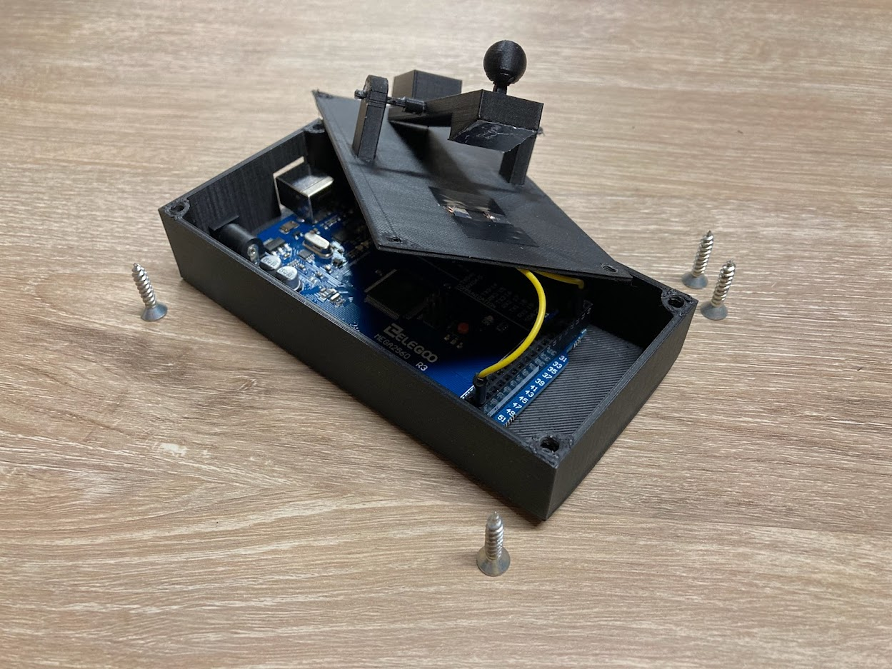

# Morse Keyer

As an amateur radio hobbyist, I have always wanted to learn morse code by doing. However,
there are no tools which I know of that translate keypress durations to morse and alphanumericals.

So, I designed a morse keyer in Fusion 360, 3D-printed it using a Creality Ender 3 V2, and programmed
it using Arduino C++ and Python.

Watch the demo <a href="https://youtu.be/wTR2LFjZmM0">here</a>!

